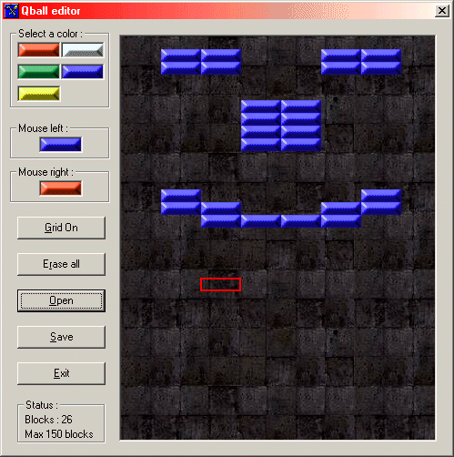



## Qball editor

### Description

this is the editor for qball nothing special....

It has a scortcut by right clicking on a level file you can press play(if you have the qball game see other submitions) or edit

thx (i think you know what to do ;-))
 
### More Info
 

             |
---                |---
**Submitted On**   |2001-01-31 13:10:30
**By**             |[egbert](https://github.com/Planet-Source-Code/PSCIndex/blob/master/ByAuthor/egbert.md)
**Level**          |Beginner
**User Rating**    |4.7 (14 globes from 3 users)
**Compatibility**  |VB 5\.0, VB 6\.0
**Category**       |[Games](https://github.com/Planet-Source-Code/PSCIndex/blob/master/ByCategory/games__1-38.md)
**World**          |[Visual Basic](https://github.com/Planet-Source-Code/PSCIndex/blob/master/ByWorld/visual-basic.md)
**Archive File**   |[CODE\_UPLOAD143611312001\.zip](https://github.com/Planet-Source-Code/egbert-qball-editor__1-14867/archive/master.zip)

